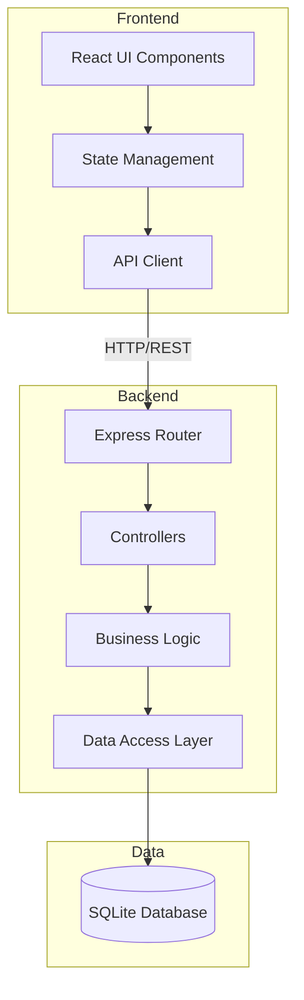
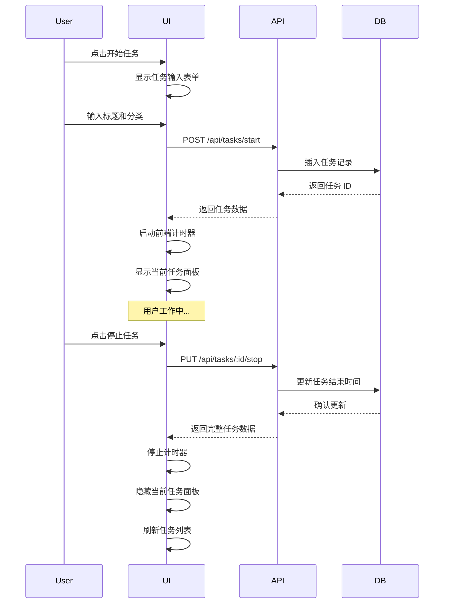

# Design Document

## Overview

时间追踪应用是一个轻量级的 Web 应用，采用前后端分离架构。前端使用现代 JavaScript 框架构建响应式 UI，后端提供 RESTful API 处理业务逻辑和数据持久化。应用设计遵循简洁、快速、零干扰的原则。

### Technology Stack

**前端:**
- React 18+ (UI 框架)
- TypeScript (类型安全)
- Tailwind CSS (样式框架)
- Chart.js (数据可视化)
- Axios (HTTP 客户端)
- React Router (路由管理)

**后端:**
- Node.js + Express (API 服务器)
- TypeScript (类型安全)
- SQLite (轻量级数据库)
- Prisma (ORM)

**开发工具:**
- Vite (前端构建工具)
- ESLint + Prettier (代码规范)

### Key Design Decisions

**1. 前后端分离架构**
- 理由：提供更好的可扩展性和维护性，前后端可独立开发和部署
- 权衡：增加了部署复杂度，但对于未来功能扩展（如移动应用）更有利

**2. SQLite 数据库**
- 理由：轻量级、零配置、适合单用户应用
- 权衡：不支持高并发，但当前需求不需要多用户支持

**3. React + TypeScript**
- 理由：类型安全减少运行时错误，React 生态系统成熟
- 权衡：学习曲线较陡，但长期维护成本更低

**4. 前端计时器 + 后端时间戳**
- 理由：前端计时器提供实时反馈（需求 1.3），后端时间戳确保数据准确性
- 权衡：需要同步前后端时间，但提供了更好的用户体验

**5. 无限滚动而非传统分页**
- 理由：更流畅的用户体验，符合现代 Web 应用习惯
- 权衡：首次加载可能较慢，但通过分页加载（每次 20 条）缓解

**6. Context API 而非 Redux**
- 理由：应用状态管理需求简单，Context API 足够且更轻量
- 权衡：大型应用可能需要迁移到 Redux，但当前规模适合

## Architecture

### System Architecture



### Page Structure

**设计决策：** 采用三页面结构，保持导航简单清晰。

**页面组织：**

1. **首页（Home）**
   - 开始任务按钮（主要操作）
   - 当前任务面板（条件显示）
   - 今日统计摘要
   - 快速手动输入入口
   - 路由：`/`

2. **任务列表页（Tasks）**
   - 任务历史记录列表
   - 分类筛选器
   - 无限滚动加载
   - 路由：`/tasks`

3. **统计页（Statistics）**
   - 今日/本周切换标签
   - 总时长和任务数量
   - 分类占比饼图
   - 每日分布柱状图（周视图）
   - Top 5 任务排行榜
   - 路由：`/stats`

**导航设计：**
- 桌面端：左侧固定导航栏
- 移动端：底部固定导航栏
- 当前页面高亮显示

### Application Flow



## UI/UX Design Principles

### Responsive Design Strategy（需求 7）

**设计决策：** 采用移动优先（Mobile-First）设计方法，确保在所有设备上提供一致的用户体验。

**断点定义：**
- 移动设备：< 768px（单列布局）
- 平板设备：768px - 1024px（两列布局）
- 桌面设备：> 1024px（完整布局）

**响应式规则：**
1. 所有交互元素最小点击区域 44x44px（需求 7.4）
2. 最小字体大小 14px（需求 7.5）
3. 移动端使用底部固定导航栏
4. 桌面端使用侧边导航栏
5. 统计图表在移动端垂直堆叠，桌面端水平排列

### 简洁界面设计原则（需求 10）

**设计决策：** 遵循"少即是多"的设计哲学，减少认知负担，让用户专注于时间记录。

**核心原则：**
1. **首页简洁性**（需求 10.1）
   - 仅显示：开始任务按钮、当前任务面板（如有）、今日统计
   - 避免信息过载
   
2. **配色方案**（需求 10.2）
   - 主色：蓝色（#3B82F6）- 用于主要操作
   - 辅助色：绿色（#10B981）- 用于成功状态
   - 中性色：灰色系 - 用于背景和文字
   - 限制使用不超过 3 种主要颜色

3. **视觉层次**（需求 10.3）
   - 使用字体大小、粗细、颜色区分主次信息
   - 主要操作使用大按钮和鲜明颜色
   - 次要信息使用较小字体和低对比度

4. **操作限制**（需求 10.4）
   - 每个页面主要操作不超过 3 个
   - 首页：开始任务、停止任务、查看统计
   - 任务列表页：筛选、加载更多
   - 统计页：切换周期

5. **图标使用**（需求 10.5）
   - 所有操作按钮配合图标和文字标签
   - 使用通用图标（播放/暂停、时钟、图表等）
   - 提高可识别性和国际化支持

## Components and Interfaces

### Frontend Components

#### 1. Layout Components

**AppLayout**
- 职责：应用主布局容器
- Props：`children: ReactNode`
- 包含：导航栏、主内容区、响应式容器

**Navigation**
- 职责：应用导航菜单
- Props：`currentPath: string`
- 功能：首页、任务列表、统计页面导航

#### 2. Task Components

**TaskStartButton**
- 职责：快速开始任务的主按钮
- Props：`onStart: () => void`
- 状态：禁用状态（当有任务运行时）

**TaskInputForm**
- 职责：任务信息输入表单
- Props：
  - `onSubmit: (data: TaskInput) => void`
  - `onCancel: () => void`
  - `mode: 'timer' | 'manual'`
- 字段：
  - `title: string` (必填，最多 200 字符 - 需求 2.4)
  - `category: Category` (必填 - 需求 2.5)
  - `duration?: number` (仅手动模式，1-1440 分钟 - 需求 3.4)
- 验证规则：
  - 标题非空且不超过 200 字符
  - 必须选择分类
  - 手动模式下时长为正数且不超过 24 小时

**CurrentTaskPanel**
- 职责：显示正在进行的任务（需求 6）
- Props：
  - `task: RunningTask`
  - `onStop: () => void`
- 显示：标题、分类、实时计时、停止按钮
- 行为：
  - 每秒更新已用时间显示（需求 6.3）
  - 任务停止后自动隐藏（需求 6.4）
  - 固定在页面顶部显示（需求 6.1）

**TaskList**
- 职责：显示任务历史记录（需求 4）
- Props：
  - `tasks: Task[]`
  - `onLoadMore: () => void`
  - `hasMore: boolean`
  - `filterCategory?: Category`
- 功能：
  - 分页加载（需求 4.4）
  - 分类筛选（需求 4.5）
  - 按时间倒序排列（需求 4.3）
- 设计决策：使用无限滚动而非传统分页，提供更流畅的用户体验

**TaskItem**
- 职责：单个任务记录展示（需求 4.2）
- Props：`task: Task`
- 显示：
  - 标题
  - 分类标签（使用 CategoryBadge）
  - 开始时间和结束时间
  - 时长（使用 DurationDisplay）

#### 3. Statistics Components

**DailySummary**
- 职责：今日时间统计摘要（需求 5.1）
- Props：`date: Date`
- 显示：总时长、任务数量、分类分布
- 设计决策：在首页显示今日摘要，符合需求 10.1 的简洁原则

**WeeklySummary**
- 职责：本周时间统计（需求 5.2）
- Props：`weekStart: Date`
- 显示：总时长、每日分布柱状图（需求 5.5）

**CategoryPieChart**
- 职责：分类时间占比饼图（需求 5.3, 5.4）
- Props：
  - `data: CategoryStats[]`
  - `period: 'day' | 'week'`
- 使用 Chart.js 渲染
- 设计决策：饼图直观展示分类占比，符合用户快速理解时间分配的需求

**TopTasksRanking**
- 职责：任务排行榜（需求 9）
- Props：
  - `tasks: TaskRanking[]`
  - `period: 'day' | 'week'` （需求 9.5）
  - `limit: number` （默认 5 - 需求 9.1）
- 显示：Top N 任务及其总时长（需求 9.4）
- 功能：按任务标题聚合并按总时长降序排列（需求 9.2, 9.3）

#### 4. Shared Components

**CategoryBadge**
- 职责：分类标签显示
- Props：`category: Category`
- 样式：不同分类使用不同颜色（需求 10.5 - 使用图标配合文字）
- 颜色方案：
  - 工作 (work): 蓝色
  - 学习 (study): 绿色
  - 娱乐 (entertainment): 紫色
  - 日常琐碎 (misc): 灰色

**DurationDisplay**
- 职责：格式化显示时长（需求 1.3 - 实时显示已经过时间）
- Props：`minutes: number`
- 格式：自动选择 "Xh Ym" 或 "Ym" 格式
- 逻辑：
  - 小于 60 分钟：显示 "Ym"
  - 大于等于 60 分钟：显示 "Xh Ym"

**CategorySelect**
- 职责：分类选择下拉菜单
- Props：
  - `value: Category`
  - `onChange: (category: Category) => void`
- 选项：工作、学习、娱乐、日常琐碎

### Frontend State Management

使用 React Context + useReducer 进行状态管理：

**设计决策：** 选择 Context + useReducer 而非 Redux 是为了保持应用轻量级，避免引入额外的依赖。对于这个规模的应用，Context API 提供了足够的状态管理能力，同时保持代码简洁。

**AppContext**
```typescript
interface AppState {
  currentTask: RunningTask | null;
  tasks: Task[];
  stats: Statistics;
  loading: boolean;
  error: string | null;
  pendingSaves: Task[]; // 用于网络恢复后重试保存（需求 8）
}

type AppAction =
  | { type: 'START_TASK'; payload: RunningTask }
  | { type: 'STOP_TASK'; payload: Task }
  | { type: 'LOAD_TASKS'; payload: Task[] }
  | { type: 'LOAD_STATS'; payload: Statistics }
  | { type: 'SET_ERROR'; payload: string }
  | { type: 'CLEAR_ERROR' }
  | { type: 'ADD_PENDING_SAVE'; payload: Task }
  | { type: 'CLEAR_PENDING_SAVES' };
```

### Backend API Endpoints

#### Task Management

**POST /api/tasks/start**
- 描述：开始新任务计时（需求 1.1, 1.4）
- Request Body:
```json
{
  "title": "string",
  "category": "work" | "study" | "entertainment" | "misc"
}
```
- 验证：
  - 标题必填且不超过 200 字符
  - 分类必须是四个选项之一
  - 检查是否已有运行中的任务（返回 409 Conflict）
- Response: `201 Created`
```json
{
  "id": "string",
  "title": "string",
  "category": "string",
  "startTime": "ISO8601",
  "status": "running"
}
```

**PUT /api/tasks/:id/stop**
- 描述：停止任务计时（需求 1.2, 1.5）
- 业务逻辑：
  - 记录结束时间戳（endTimestamp）
  - 自动计算 duration = (endTime - startTime) / 60000（转换为分钟）
  - 更新任务状态为 'completed'
- Response: `200 OK`
```json
{
  "id": "string",
  "title": "string",
  "category": "string",
  "startTime": "ISO8601",
  "endTime": "ISO8601",
  "duration": 120,
  "status": "completed"
}
```

**POST /api/tasks/manual**
- 描述：手动创建任务记录（需求 3）
- Request Body:
```json
{
  "title": "string",
  "category": "string",
  "duration": 60
}
```
- 验证：
  - 标题必填且不超过 200 字符
  - 分类必须是四个选项之一
  - 时长必须为正数且不超过 1440 分钟（24 小时）（需求 3.4）
- 业务逻辑：
  - 使用当前时间作为 endTime（需求 3.5）
  - 反推 startTime = endTime - (duration * 60000)
  - 状态设置为 'completed'
- Response: `201 Created`

**GET /api/tasks**
- 描述：获取任务列表
- Query Parameters:
  - `page`: number (default: 1)
  - `limit`: number (default: 20)
  - `category`: string (optional)
- Response: `200 OK`
```json
{
  "tasks": [...],
  "total": 100,
  "page": 1,
  "hasMore": true
}
```

**GET /api/tasks/current**
- 描述：获取当前运行中的任务
- Response: `200 OK` 或 `204 No Content`

#### Statistics

**GET /api/stats/daily**
- 描述：获取指定日期的统计
- Query Parameters:
  - `date`: string (ISO date, default: today)
- Response: `200 OK`
```json
{
  "date": "2025-11-26",
  "totalDuration": 480,
  "taskCount": 12,
  "categoryBreakdown": [
    { "category": "work", "duration": 300, "percentage": 62.5 },
    { "category": "study", "duration": 120, "percentage": 25.0 },
    { "category": "entertainment", "duration": 60, "percentage": 12.5 }
  ]
}
```

**GET /api/stats/weekly**
- 描述：获取指定周的统计
- Query Parameters:
  - `weekStart`: string (ISO date, default: this week)
- Response: `200 OK`
```json
{
  "weekStart": "2025-11-24",
  "weekEnd": "2025-11-30",
  "totalDuration": 2400,
  "dailyBreakdown": [
    { "date": "2025-11-24", "duration": 400 },
    ...
  ],
  "categoryBreakdown": [...]
}
```

**GET /api/stats/top-tasks**
- 描述：获取任务排行榜
- Query Parameters:
  - `period`: 'day' | 'week' (default: 'week')
  - `limit`: number (default: 5)
- Response: `200 OK`
```json
{
  "period": "week",
  "tasks": [
    {
      "title": "编写代码",
      "category": "work",
      "totalDuration": 600,
      "occurrences": 8
    },
    ...
  ]
}
```

### Auto-Save and Error Recovery（需求 8）

**设计决策：** 实现乐观更新（Optimistic Update）策略，立即更新 UI 并在后台保存数据，提供流畅的用户体验。

**保存机制：**
1. **立即保存**（需求 8.1, 8.2）
   - 任务停止时立即调用 API 保存
   - 手动任务创建时立即调用 API 保存
   - 使用 async/await 确保保存完成

2. **错误处理**（需求 8.3）
   - 保存失败时显示 Toast 错误提示
   - 将失败的任务保存到 `pendingSaves` 状态
   - 保留用户输入数据，允许重试

3. **自动重试**（需求 8.5）
   - 监听网络状态变化（online/offline 事件）
   - 网络恢复时自动重试 `pendingSaves` 中的任务
   - 使用指数退避策略（1s, 2s, 4s）
   - 最多重试 3 次

4. **UI 反馈**（需求 8.4）
   - 保存成功：立即更新任务列表和统计数据
   - 保存中：显示加载指示器
   - 保存失败：显示错误消息和重试按钮
   - 离线状态：显示离线提示和待保存任务数量

**实现细节：**
```typescript
// 前端保存逻辑
async function saveTask(task: Task) {
  try {
    const response = await api.post('/tasks', task);
    dispatch({ type: 'SAVE_SUCCESS', payload: response.data });
    dispatch({ type: 'CLEAR_PENDING_SAVES' });
  } catch (error) {
    dispatch({ type: 'ADD_PENDING_SAVE', payload: task });
    dispatch({ type: 'SET_ERROR', payload: 'SAVE_FAILED' });
  }
}

// 网络恢复时重试
window.addEventListener('online', () => {
  retryPendingSaves();
});
```

### Backend Service Layer

**TaskService**
- `startTask(data: CreateTaskDto): Promise<Task>` - 创建新任务并检查并发冲突
- `stopTask(taskId: string): Promise<Task>` - 停止任务并计算时长
- `createManualTask(data: ManualTaskDto): Promise<Task>` - 创建手动任务并反推时间
- `getTaskList(options: ListOptions): Promise<PaginatedTasks>` - 分页获取任务列表
- `getCurrentTask(): Promise<Task | null>` - 获取当前运行中的任务
- `validateTaskInput(data: CreateTaskDto | ManualTaskDto): void` - 验证输入数据

**StatisticsService**
- `getDailyStats(date: Date): Promise<DailyStats>`
- `getWeeklyStats(weekStart: Date): Promise<WeeklyStats>`
- `getTopTasks(period: Period, limit: number): Promise<TaskRanking[]>`
- `getCategoryBreakdown(startDate: Date, endDate: Date): Promise<CategoryStats[]>`

## Data Models

### Database Schema

```prisma
model Task {
  id          String   @id @default(uuid())
  title       String
  category    String
  startTime   DateTime
  endTime     DateTime?
  duration    Int?     // 分钟数
  status      String   // 'running' | 'completed'
  createdAt   DateTime @default(now())
  updatedAt   DateTime @updatedAt
  
  @@index([startTime])
  @@index([category])
  @@index([status])
}
```

### TypeScript Interfaces

**Frontend Types**
```typescript
enum Category {
  WORK = 'work',
  STUDY = 'study',
  ENTERTAINMENT = 'entertainment',
  MISC = 'misc'
}

interface Task {
  id: string;
  title: string;
  category: Category;
  startTime: string; // ISO8601
  endTime: string | null;
  duration: number | null; // 分钟
  status: 'running' | 'completed';
}

interface RunningTask extends Task {
  status: 'running';
  elapsedMinutes: number; // 前端计算的实时时长
}

interface TaskInput {
  title: string;
  category: Category;
  duration?: number; // 仅手动模式
}

interface CategoryStats {
  category: Category;
  duration: number;
  percentage: number;
}

interface DailyStats {
  date: string;
  totalDuration: number;
  taskCount: number;
  categoryBreakdown: CategoryStats[];
}

interface WeeklyStats {
  weekStart: string;
  weekEnd: string;
  totalDuration: number;
  dailyBreakdown: Array<{
    date: string;
    duration: number;
  }>;
  categoryBreakdown: CategoryStats[];
}

interface TaskRanking {
  title: string;
  category: Category;
  totalDuration: number;
  occurrences: number;
}
```

**Backend DTOs**
```typescript
interface CreateTaskDto {
  title: string;
  category: string;
}

interface ManualTaskDto {
  title: string;
  category: string;
  duration: number; // 分钟
}

interface ListOptions {
  page: number;
  limit: number;
  category?: string;
}

interface PaginatedTasks {
  tasks: Task[];
  total: number;
  page: number;
  hasMore: boolean;
}
```

## Error Handling

### Frontend Error Handling

**错误类型分类：**
1. **网络错误**：API 请求失败
2. **验证错误**：用户输入不符合要求
3. **业务逻辑错误**：如尝试同时运行多个任务

**错误处理策略：**
- 使用 Toast 通知显示错误消息
- 网络错误自动重试（最多 3 次）
- 验证错误在表单字段下方显示
- 保留用户输入数据，避免重新填写

**错误消息示例：**
```typescript
const ERROR_MESSAGES = {
  NETWORK_ERROR: '网络连接失败，请检查网络后重试',
  TASK_ALREADY_RUNNING: '已有任务正在运行，请先停止当前任务',
  INVALID_DURATION: '时长必须在 1 分钟到 24 小时之间', // 需求 3.4
  TITLE_REQUIRED: '请输入任务标题', // 需求 2.1
  TITLE_TOO_LONG: '任务标题不能超过 200 个字符', // 需求 2.4
  CATEGORY_REQUIRED: '请选择任务分类', // 需求 2.5
  SAVE_FAILED: '保存失败，数据已暂存，将在网络恢复后自动重试' // 需求 8.3, 8.5
};
```

### Backend Error Handling

**HTTP 状态码使用：**
- `200 OK`: 成功
- `201 Created`: 资源创建成功
- `204 No Content`: 成功但无返回内容
- `400 Bad Request`: 请求参数错误
- `404 Not Found`: 资源不存在
- `409 Conflict`: 业务逻辑冲突（如任务已在运行）
- `500 Internal Server Error`: 服务器错误

**错误响应格式：**
```json
{
  "error": {
    "code": "TASK_ALREADY_RUNNING",
    "message": "A task is already running",
    "details": {
      "currentTaskId": "abc123"
    }
  }
}
```

**错误处理中间件：**
- 全局错误捕获
- 错误日志记录
- 统一错误响应格式
- 敏感信息过滤（生产环境）

## Testing Strategy

### Frontend Testing

**单元测试 (Jest + React Testing Library)**
- 组件渲染测试
- 用户交互测试
- 状态管理逻辑测试
- 工具函数测试（时间格式化、时长计算等）

**测试覆盖重点：**
1. TaskInputForm 验证逻辑
2. CurrentTaskPanel 计时器更新
3. DurationDisplay 格式化逻辑
4. CategorySelect 选项渲染
5. State reducer 状态转换

**集成测试**
- API 客户端与模拟后端交互
- 完整用户流程测试（开始任务 → 停止任务 → 查看统计）

### Backend Testing

**单元测试 (Jest)**
- Service 层业务逻辑测试
- Repository 层数据访问测试
- 工具函数测试（时长计算、日期处理等）

**测试覆盖重点：**
1. TaskService.startTask - 验证任务创建
2. TaskService.stopTask - 验证时长计算
3. StatisticsService.getDailyStats - 验证统计聚合
4. 并发任务检测逻辑
5. 手动任务时间反推逻辑

**API 测试 (Supertest)**
- 端点响应测试
- 请求验证测试
- 错误处理测试
- 边界条件测试

**测试数据库：**
- 使用内存 SQLite 数据库
- 每个测试前重置数据库
- 使用工厂函数生成测试数据

### E2E Testing

**工具：** Playwright

**测试场景：**
1. 完整任务流程：开始 → 运行 → 停止 → 查看历史
2. 手动任务创建流程
3. 统计页面数据展示
4. 响应式布局在不同设备上的表现
5. 网络错误恢复流程

## Performance Considerations

### Frontend Optimization

1. **代码分割**
   - 路由级别懒加载
   - Chart.js 按需加载
   - 设计决策：统计页面的图表库较大，按需加载可减少首屏加载时间

2. **渲染优化**
   - React.memo 优化组件重渲染
   - useMemo/useCallback 缓存计算结果
   - 虚拟滚动（任务列表超过 100 项时）
   - CurrentTaskPanel 使用 requestAnimationFrame 优化计时器更新

3. **资源优化**
   - 图片/图标使用 SVG（需求 10.5）
   - Tailwind CSS 生产构建 purge
   - Gzip 压缩

4. **缓存策略**
   - API 响应缓存（使用 SWR 或 React Query）
   - 统计数据缓存 5 分钟
   - 设计决策：统计数据变化频率低，缓存可显著减少 API 调用

### Backend Optimization

1. **数据库优化**
   - 关键字段索引（startTime, category, status）
   - 分页查询避免全表扫描
   - 统计查询使用聚合函数

2. **API 性能**
   - 响应压缩（gzip）
   - 合理的分页大小（默认 20）
   - 避免 N+1 查询

3. **缓存**
   - 统计数据缓存（Redis 或内存缓存）
   - 缓存失效策略：任务创建/更新时清除相关缓存

## Security Considerations

### Frontend Security

1. **输入验证**
   - 客户端验证所有用户输入
   - XSS 防护：React 默认转义
   - 标题长度限制（200 字符）（需求 2.4）
   - 时长范围验证（1-1440 分钟）（需求 3.4）
   - 分类枚举验证（需求 2.5）

2. **API 通信**
   - HTTPS only（生产环境）
   - CORS 配置
   - API 请求超时设置（30 秒）

### Backend Security

1. **输入验证**
   - 使用验证库（如 Joi 或 Zod）
   - SQL 注入防护：使用 Prisma ORM
   - 请求体大小限制

2. **API 安全**
   - Rate limiting（防止滥用）
   - CORS 白名单
   - 安全响应头（Helmet.js）

3. **数据安全**
   - 数据库文件权限控制
   - 敏感信息不记录日志
   - 定期数据备份

## Deployment

### Development Environment

```bash
# 前端
cd frontend
npm install
npm run dev  # http://localhost:5173

# 后端
cd backend
npm install
npm run dev  # http://localhost:3000
```

### Production Build

```bash
# 前端构建
cd frontend
npm run build  # 输出到 dist/

# 后端构建
cd backend
npm run build  # 输出到 dist/
```

### Deployment Options

**选项 1: 单服务器部署**
- 使用 Nginx 反向代理
- 前端静态文件由 Nginx 服务
- 后端 API 通过 PM2 运行

**选项 2: 容器化部署**
- Docker Compose 编排
- 前端容器 + 后端容器
- 数据卷持久化 SQLite 数据库

**环境变量配置：**
```env
# Backend
PORT=3000
DATABASE_URL=file:./data/time-tracking.db
NODE_ENV=production
CORS_ORIGIN=https://your-domain.com

# Frontend
VITE_API_URL=https://api.your-domain.com
```

## Future Enhancements

以下功能不在当前版本范围内，但可作为未来迭代方向：

1. **用户认证**：多用户支持
2. **数据导出**：CSV/JSON 格式导出
3. **标签系统**：为任务添加自定义标签
4. **目标设置**：每日/每周时间目标
5. **提醒功能**：长时间任务提醒
6. **离线模式**：PWA + Service Worker
7. **数据同步**：跨设备数据同步
8. **报表生成**：月度/年度报表
